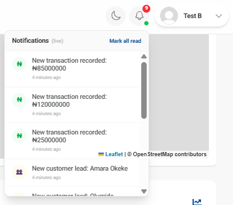
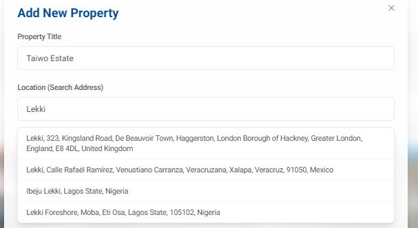

# NexCity Realty Dashboard (Frontend)

NexCity Realty is a premium Real Estate CRM and property management dashboard designed for real estate agents and administrators. It features interactive analytics, real-time sync with database events, and address geocoding.

---

## 1. 🏗️ Architecture & Domain Overview

The application is architected as a decoupled real-time system that balances standard request-response operations with a live, server-pushed event stream. 

### Core State Strategy
To ensure maximum performance and maintainability, the application strictly separates its state layers based on intent:
1. **Server State (TanStack React Query)**: Handles all standard database queries (fetching agents, loading property pages, listing transactions). It manages cache validation, caching limits, and data refetching.
2. **Client State (Redux Toolkit + Sockets)**: Handles transient events that arrive *unprompted* from the server. It stores the live notifications feed, unread notification counts, and real-time dashboard stat card deltas.

### System Data Flow
When a user adds a property or transaction, the event flows through the system in real-time as follows:

```
┌──────────────────────────────────────┐
│  1. Supabase (PostgreSQL Database)   │ 
└──────────────────┬───────────────────┘
                   │  (postgres_changes INSERT event)
                   ▼
┌──────────────────────────────────────┐
│ 2. Realtime server (Node.js + Express)│ [Render server relay]
└──────────────────┬───────────────────┘
                   │  (io.emit('notification:new', payload))
                   ▼
┌──────────────────────────────────────┐
│ 3. Client Socket Hook (useSocket.js)  │ [Listens over open WebSocket connection]
└──────────────────┬───────────────────┘
                   │  (dispatch Redux actions & React Query invalidation)
                   ▼
┌──────────────────────────────────────┐
│   4. React UI (Toaster, Bell, Map)   │ [Updates count, draws pin, pops toast]
└──────────────────────────────────────┘
```

---

## 2. 🗺️ Repository Map

For easy navigation by reviewers, here are the major parts of the codebase:

```text
nexCity/
├── docs/                             # Project screenshots for documentation
├── src/
│   ├── app/
│   │   └── store.js                  # Redux store configuration
│   ├── features/
│   │   ├── Authentication/           # Sign-in, sign-up, session hooks
│   │   ├── agents/                   # Agent directories and statistics
│   │   ├── customers/                # Lead status tracking and customer tables
│   │   ├── dashboard/                # Stat card grids, Recharts, and Leaflet Map
│   │   │   └── statsSlice.js         # Redux slice for live stats counters
│   │   ├── notifications/
│   │   │   ├── NotificationBell.jsx  # Notification icon with badge & feed
│   │   │   └── notificationsSlice.js # Redux slice for notifications feed
│   │   ├── properties/               # Property grids, details, and Add Modal
│   │   └── transactions/             # Transactions lists and payment status
│   ├── hooks/
│   │   ├── useSocket.js              # Socket.io connection hook and event bridge
│   │   └── useGeocode.js             # Autocomplete geocoding hook via Axios
│   ├── services/
│   │   ├── supabase.js               # Supabase database client initialization
│   │   └── apiProperties.js          # Supabase queries for the properties table
│   ├── ui/
│   │   └── Header.jsx                # Header layout (Profile, Bell, Dark Mode)
│   ├── App.jsx                       # Routing, QueryClient, and Redux Providers
│   └── index.css                     # Tailwind variables and global styles
```

* **Relay Server Code**: The codebase for the backend relay server is hosted in a separate repository at [adeyemo-taiwo-m/Nexcity-server](https://github.com/adeyemo-taiwo-m/Nexcity-server).

---

## 3. 🌟 Original Functionality

Before this assessment, the dashboard featured the following CRM capabilities:
* **CRM Modules**: Comprehensive tracking for properties, customer leads, real estate agents, and financial transactions.
* **Database Caching**: Server-state management using TanStack React Query to fetch, cache, and mutate database tables.
* **Analytics**: SVG performance charts and graphs utilizing Recharts.
* **Maps**: Interactive Leaflet maps displaying properties based on hardcoded coordinate locations.
* **Theme Customization**: Responsive dark and light theme toggling using Tailwind CSS custom color schemes.

---

## 4. 🚀 New Functionality & Improvements

  During this assessment, the following integrations and core improvements were added:
  
  ### A. Real-Time Socket.io Server Relay
  * A standalone Node/Express server was built and deployed on Render. It subscribes to Supabase replication channels and relays postgres changes over Socket.io.
  * **Security Choice**: All privileged database permissions (`SUPABASE_SERVICE_ROLE_KEY`) are kept on the backend server and never exposed to the client.
  
  
  
  ### B. Redux Toolkit Client State
  * **Unread badge count** and **live alert feeds** are stored in a Redux Toolkit state, fully separating transient real-time alerts from React Query's request-based caching.
  
  ### C. Live Dashboard Stat Cards
  * Dashboard stat counters (Total Properties, Available Properties) update dynamically as socket events are received. Counts increment instantly using Redux deltas before background refetches occur.
  
  ### D. Real-Time Map Synchronization
  * We integrated React Query invalidation directly into the Socket client hook. When a new property is received, the cache is invalidated, forcing a background refetch. The Leaflet map instantly draws the new coordinate pin marker without a page refresh!
  
  ### E. Axios Address Geocoding with Cancellation
  * Integrated OpenStreetMap's Nominatim geocoding API inside the Property Forms.
  * Uses an `AbortController` signal inside the Axios call to cancel outdated in-flight requests when typing fast, eliminating race conditions.
  
  

### F. Dropdown & Layout Stacking Fixes
* Rearranged utilities in the navigation bar to support a premium ordered layout.
* Updated `<Header>` stacking contexts to `position: relative` with a higher z-index (`1005`), resolving the Leaflet map z-index collision so notifications overlay cleanly on top of the map.

---

## 5. 🔗 Live Application URLs

* **Frontend Dashboard (Vercel)**: [https://nex-city-reality-dashboard.vercel.app](https://nex-city-reality-dashboard.vercel.app)
* **Realtime Relay Server (Render)**: [https://nexcity-server.onrender.com](https://nexcity-server.onrender.com)

---

## 6. 🧪 Testing Guide

Follow these steps to verify all the newly implemented features:

### Test 1: Real-Time Sync & Multi-User Collaboration
This test verifies the Socket.io relay pipeline and Redux state synchronization across multiple users.

1. Open your browser and navigate to the live dashboard: [https://nex-city-reality-dashboard.vercel.app](https://nex-city-reality-dashboard.vercel.app)
2. Log in to **Browser A** (e.g. Chrome) using:
   * **Email**: `testa@gmail.com`
   * **Password**: `Testa1234`
3. Open an **Incognito window or a different browser** (Browser B, e.g. Firefox) and log in using:
   * **Email**: `testb@gmail.com`
   * **Password**: `Testb1234`
4. Position the windows side-by-side so both dashboards are visible.
5. In **Browser A**, go to the **Properties** tab and click **Add New Property**.
6. Fill in the form details and submit.
7. In **Browser B**, observe:
   * A **toast notification** pops up instantly saying a new property was added.
   * The **Notification Bell's red badge** increments.
   * The **Total Properties** and **Available Properties** counters on the Dashboard card increment by 1 live without a refresh.
   * The **Leaflet Map** automatically adds a new coordinate pin for the listing.

### Test 2: Axios Geocoding Autocomplete
This test verifies Nominatim geocoding and `AbortController` cancellation.

1. Open the **Add Property** modal.
2. In the **Location (Search Address)** field, start typing an address (e.g. `Lekki`).
3. Observe the loading spinner and matching autocomplete suggestions.
4. Click on a suggestion (e.g. `Ibeju Lekki, Lagos State, Nigeria`).
5. Open your browser **F12 Network Tab** and repeat typing quickly. You will see older intermediate requests marked as **`(canceled)`** in red, proving the `AbortController` is successfully canceling race conditions.

### Test 3: Connection Resilience
1. Observe the **green dot** next to the Notification Bell on the header (indicates Socket is connected).
2. Briefly disconnect your internet connection.
3. Observe the green dot turn **red**, showing the offline state.
4. Reconnect your internet. The Socket client will automatically reconnect and the dot will turn green.
